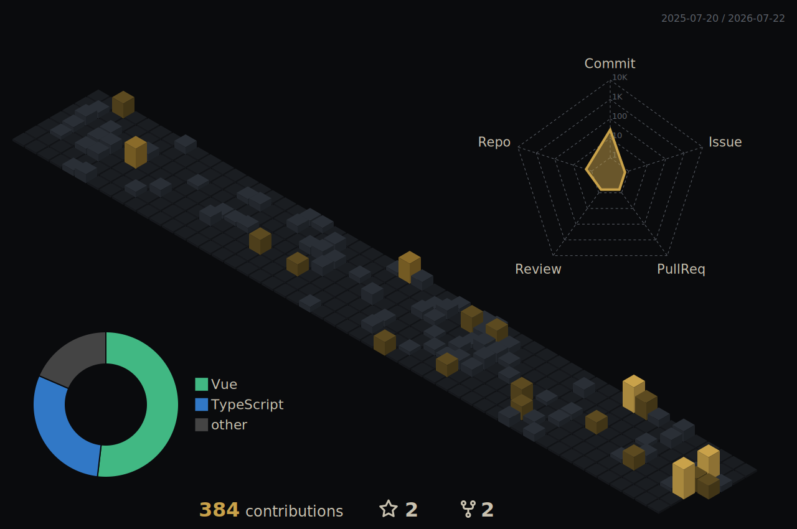
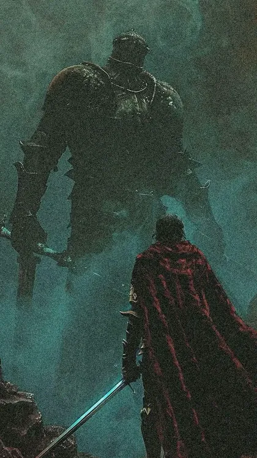

	

<i>Every refactor begins the same way: alone, kneeling before what's broken, blade in hand.</i>

	
  	

	

&#9876;&#65039; &nbsp;<b>Gabriel Alves.</b> A Software Developer who learned his craft in the trenches of production code.

&#127891; &nbsp;Graduate in Systems Analysis and Development.

&#128737;&#65039; &nbsp;Arsenal: Java, Spring Boot, ReactJS, C# and React Native. The weapons I carry against complex problems in the software industry.

&#127981; &nbsp;Currently sworn to FBM Brasil, a multinational company, wielding .NET, Vue and Spring Boot in daily battles.

&#128293; &nbsp;Sharpening my craft further in Web Development and the ways of Spring Boot 3.

&#127984; &nbsp;Prior campaigns fought at C6 Bank and PayGo.

&#129309; &nbsp;Ever open to new alliances and expeditions. Reach out, wanderer.

 
 

  

  

**Ancient Languages**

&nbsp;
&nbsp;
&nbsp;
&nbsp;

**Spells & Tools**

&nbsp;
&nbsp;
&nbsp;
&nbsp;
&nbsp;
&nbsp;
&nbsp;
&nbsp;
&nbsp;
&nbsp;

 

 

	
	
  
  

