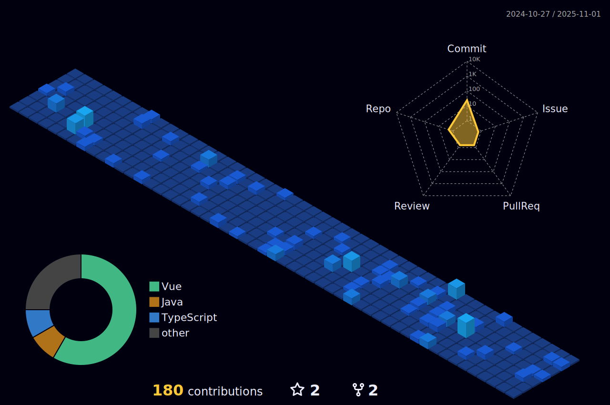

	

	
  	

	

## 👨🏻‍💻 &nbsp;About Me:

👋 &nbsp;Hi there! I'm Gabriel, a Software Developer.

👨‍🎓 &nbsp;Graduated in Systems Analysis and Development.

🚀 &nbsp;My technical skillset includes Java, Springboot, ReactJS, C# and React Native, and I'm passionate about using these tools to solve complex problems in the software industry.

🌱 &nbsp;I am currently working to build on my experience in the Web Development field and expand my knowledge on Springboot 3.

💼 &nbsp;In the past, I worked as an intern for C6 Bank and PayGo.

🤠&nbsp;I'm always open to new opportunities and collaborations, so feel free to reach out to me!

 

  

  

## 🛠 &nbsp;Tech Stack:

### 💻 &nbsp;Languages:

&nbsp;
&nbsp;
&nbsp;
&nbsp;

### 🚀 &nbsp;Technologies:

&nbsp;
&nbsp;
&nbsp;
&nbsp;
&nbsp;
&nbsp;
&nbsp;
&nbsp;
&nbsp;

## 🏆 Trophies
 

 

## 📕 Pinned Repositories

	
	
  
  

